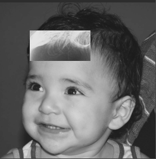

:toc: left
:toclevels: 2
:toc-title: Sumário
:!figure-caption:

= Processamento Digital de Imagens
Arthur Felipe Rodrigues Costa

:icons: font
:summary:

toc::[]
image::https://github.com/Arthurfrc/arthurfrc.github.io/blob/main/exercicio_2/biel-2.png[biel-2.png]
image::https://github.com/Arthurfrc/arthurfrc.github.io/blob/main/exercicio_2/biel-3.png[biel-3.png]
== Introdução

Esta é uma página dedicada aos projetos e atividades de PDI, criada com AsciiDoc e hospedada no GitHub Pages.

== Capítulo 2. Manipulando pixels em uma imagem
Com base no programa https://github.com/Arthurfrc/arthurfrc.github.io/blob/main/exercicio_2/pixels.cpp[pixels.cpp] , foi gerado o programa https://github.com/Arthurfrc/arthurfrc.github.io/blob/main/exercicio_2/regions.cpp[regions.cpp] que é capaz de,
ao entrar com as coordenadas (x, y) de dois pontos P1 e P2, deixar a região entre eles com cores em negativo.

Para o exercício, a imagem abaixo foi dada como entrada no código:

.Figura 1: biel.png
[link=https://github.com/Arthurfrc/arthurfrc.github.io/blob/main/exercicio_2/biel.png]
image::exercicio_2/biel.png[]

E após rodar o programa com o https://github.com/Arthurfrc/arthurfrc.github.io/blob/main/exercicio_2/CMakeLists.txt[CMakeLists.txt] adequado, foram obtido os resultados abaixo:

.Figura 2: biel-2.png
[link=https://github.com/Arthurfrc/arthurfrc.github.io/blob/main/exercicio_2/biel-2.png]
image::exercicio_2/biel-2.png[]

.Figura 3: biel-3png
[link=https://github.com/Arthurfrc/arthurfrc.github.io/blob/main/exercicio_2/biel-3.png]

== Capítulo 5, Serialização de dados em ponto flutuante via FileStorage

== Capítulo 10, Decomposição de imagens em planos de bits

== Capítulo 11, Preenchendo regiões

== Capítulo 12, Manipulação de histogramas

== Capítulo 14, Filtragem no domínio espacial I - Convolução

== Capítulo 15, Filtragem no domínio espacial II - TiltShift
