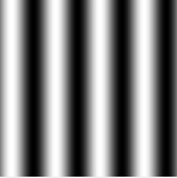

:toc: left
:toclevels: 2
:toc-title: Sumário
:!figure-caption:

= Processamento Digital de Imagens
Arthur Felipe Rodrigues Costa

:icons: font
:summary:

toc::[]
== Introdução

Esta é uma página dedicada aos projetos e atividades de PDI, criada com AsciiDoc e hospedada no GitHub Pages.

== Capítulo 2. Manipulando pixels em uma imagem
Com base no programa https://github.com/Arthurfrc/arthurfrc.github.io/blob/main/exercicio_2/pixels.cpp[pixels.cpp] , foi gerado o programa https://github.com/Arthurfrc/arthurfrc.github.io/blob/main/exercicio_2/regions.cpp[regions.cpp] que é capaz de,
ao entrar com as coordenadas (x, y) de dois pontos P1 e P2, deixar a região entre eles com cores em negativo.

Para o exercício, a imagem abaixo foi dada como entrada no código:

.Figura 1: biel.png
[link=https://github.com/Arthurfrc/arthurfrc.github.io/blob/main/exercicio_2/biel.png]
image::exercicio_2/biel.png[]

E após compilar o programa com o https://github.com/Arthurfrc/arthurfrc.github.io/blob/main/exercicio_2/CMakeLists.txt[CMakeLists.txt] adequado, foram obtido os resultados abaixo:

P1 = [100, 50]
P2 = [200, 200]

.Figura 2: biel-2.png
[link=https://github.com/Arthurfrc/arthurfrc.github.io/blob/main/exercicio_2/biel-2.png]
image::exercicio_2/biel-2.png[]

P1 = [50, 50]
P2 = [100, 150]

.Figura 3: biel-3.png
[link=https://github.com/Arthurfrc/arthurfrc.github.io/blob/main/exercicio_2/biel-3.png]
image::exercicio_2/biel-3.png[]

Para a segunda parte do exercício, a de troca de regiões, foi preciso modificar um pouco o arquivo anterior para este https://github.com/Arthurfrc/arthurfrc.github.io/blob/main/exercicio_2/CMakeLists2.txt[CMakeLists.txt] e, novamente com a imagem original do Biel.png como entrada, resultando na saída abaixo:

== Capítulo 5, Serialização de dados em ponto flutuante via FileStorage

Nesse capítulo foi instruído na atividade à se fazer uma imagem de 256x256 pixels de uma senóide com 4 períodos e amplitude de 127, e gerar um .png e um .yml dessa senóide criada.

Senóide do exercício, com 8 períodos:

.Figura 4: Senóide de 8 períodos
[link=https://github.com/Arthurfrc/arthurfrc.github.io/blob/main/exercicio_5/8-senoide-256.png]
image::exercicio_5/8-senoide-256.png[]

Arquivo YML: https://github.com/Arthurfrc/arthurfrc.github.io/blob/main/exercicio_5/8-senoide-256.yml[8-senoide-256.yml]

O resultado gerado pelo programa para a senóide de 4 períodos foi a seguinte:

.Figura 5: Senóide de 4 períodos
[link=https://github.com/Arthurfrc/arthurfrc.github.io/blob/main/exercicio_5/4-senoide-256.png]

Arquivo YML gerado: https://github.com/Arthurfrc/arthurfrc.github.io/blob/main/exercicio_5/4-senoide-256.yml[4-senoide-256.yml]

A outra parte do exercício pedia para traçar um gráfico da diferença calculada ao londo de uma linha extraída das imagens correspondentes.
O gráfico extraído foi esse:

.Figura 6: Diferença entre senóides (extraída com a ajuda do seguinte programa feito em Python https://github.com/Arthurfrc/arthurfrc.github.io/blob/main/exercicio_5/diferencas.ipynb[diferencas.ipynb], e compilado no Jupyter Notebook)
[link=https://github.com/Arthurfrc/arthurfrc.github.io/blob/main/exercicio_5/diferenca.png]
image::exercicio_5/diferenca.png[]

Pode-se notar na imagem que anova onda formada pela sobreposição das senóides das imagens anteriores também é periódica, mas com um padrão muito mais complexo do que as suas geradoras, isso acontece porque as ondas que a formaram se misturam e se interferem, o que acaba gerando essa nova estrutura oscilatória.

== Capítulo 10, Decomposição de imagens em planos de bits

== Capítulo 11, Preenchendo regiões
Nessa situação do código de https://github.com/Arthurfrc/arthurfrc.github.io/blob/main/exercicio_11/labeling.cpp[labeling.cpp] somente 255 objetos poderem ser verificados, isso acontece por causa do tipo de dados (uchar) que é utilizado, pois como esse tipo possui 8 bits, o máximo de tons que se pode utilizar é de 2^8^, e caso seja necessário contar mais do que 255 objetos, o código iria acabar voltando ao tom 0, para que isso seja possível, é necessário uma mudança de tipo para um dado que tenha mais capacidade de armazenamento, como por exemplo, usar CV_16U que suporta 16bits, assim poderia contar até 2^16^ objetos na figura.

== Capítulo 12, Manipulação de histogramas

== Capítulo 14, Filtragem no domínio espacial I - Convolução

== Capítulo 15, Filtragem no domínio espacial II - TiltShift
